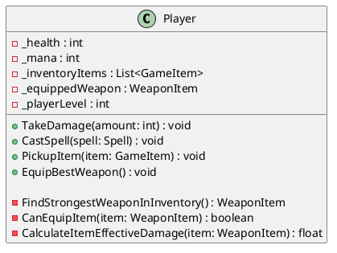

# How do we write a test for a private method?

Normally we would test it indirectly through the class public interface but this could be difficult with legacy code.

Feathers discusses this in his excellent book: *Working Effectively with Legacy Code* - Michael C. Feathers 2005,
chapter 20.

> So, how do we write a test for a private method? This has to be one of the most common testing-related questions.
> Fortunately, there is a very direct answer to this question: If we need to test a private method, we should make it
> public. If making it public bothers us, in most cases, it means that our class is doing too much, and we ought to fix
> it.
> We can move the private methods to a new class. They can be public in that class and our class can create an internal
> instance of it. That makes the methods testable and the design better.

---

This class violates the Single Responsibility Principle.



It seems that `Player` has the following responsibilities:

- Managing core player statistics (health, mana, level).
- Handling inventory.
- Managing and calculating logic for equipping items.
- Handling combat actions.

The `Player` class has public methods like `TakeDamage`, `PickupItem`, and `EquipBestWeapon`. The detailed logic for
finding and validating equipment is hidden in private methods like `FindStrongestWeaponInInventory` and `CanEquipItem`.
What would the `Player` class be like if we made these private equipment-related methods public? Well, it would seem
pretty odd. Users of the `Player` might get the idea that they are directly responsible for these low-level equipment
decisions, or might misuse them, rather than using a higher-level action like `EquipBestWeapon`.

It would be odd to have those methods public on the `Player` class, but it is far less odd—and, actually, perfectly
fine—to make them public methods on an `EquipmentManager` class.

---

```PlantUML
@startuml

hide empty members

title "Player and EquipmentManager"

class Player {
  - _health : int
  - _mana : int
  - _inventoryItems : List<GameItem>
  - _equippedWeapon : WeaponItem
  - _playerLevel : int
  - _equipmentManager : EquipmentManager

  + TakeDamage(amount: int) : void
  + CastSpell(spell: Spell) : void
  + PickupItem(item: GameItem) : void
  + EquipBestWeapon() : void
}

class EquipmentManager {
  + FindStrongestWeapon(availableItems: List<GameItem>, playerLevel: int) : WeaponItem
  + CanPlayerEquipItem(item: WeaponItem, playerLevel: int) : boolean
  + CalculateEffectiveDamage(item: WeaponItem, playerLevel: int) : float
}

Player *-- EquipmentManager : _equipmentManager

@enduml
```

You might notice that during this refactoring, method names can be slightly adjusted (e.g.,
`FindStrongestWeaponInInventory` became `FindStrongestWeapon`). This often occurs because the methods, now in a new
class, operate in a different context. They may require explicit parameters for data that was previously implicit (like
player level or the specific list of items), leading to names and signatures that better reflect their new, more
generalized role in the `EquipmentManager`.

We moved the responsibility of Equipment management and logic into a different class. We can now test
`FindStrongestWeapon()`, `CanPlayerEquipItem()`, and `CalculateEffectiveDamage()` directly since they are now public on
`EquipmentManager`.

Note that applying SRP is iterative. Even after this extraction, `Player` still manages multiple concerns. Further
refactoring could extract additional classes like `Inventory`, `CombatStats`, and `SpellCaster`, each improving
testability and simplifying the `Player` class.

Of course, if `EquipmentManager` is a volatile dependency then we need to hide it behind an interface to avoid violating
the Dependency Inversion Principle.

```PlantUML
@startuml
hide empty members
title "Player, IEquipmentManager, and EquipmentManager"

interface IEquipmentManager {
  + FindStrongestWeapon(availableItems: List<GameItem>, playerLevel: int) : WeaponItem
  + CanPlayerEquipItem(item: WeaponItem, playerLevel: int) : boolean
  + CalculateEffectiveDamage(item: WeaponItem, playerLevel: int) : float
}

class EquipmentManager implements IEquipmentManager {
  + FindStrongestWeapon(availableItems: List<GameItem>, playerLevel: int) : WeaponItem
  + CanPlayerEquipItem(item: WeaponItem, playerLevel: int) : boolean
  + CalculateEffectiveDamage(item: WeaponItem, playerLevel: int) : float
}

class Player {
  - _health : int
  - _mana : int
  - _inventoryItems : List<GameItem>
  - _equippedWeapon : WeaponItem
  - _playerLevel : int
  - _equipmentManager : IEquipmentManager

  + TakeDamage(amount: int) : void
  + CastSpell(spell: Spell) : void
  + PickupItem(item: GameItem) : void
  + EquipBestWeapon() : void
}

Player *-- IEquipmentManager : _equipmentManager


@enduml
```

In conclusion, testing private methods can be a challenge, but it is important to have good test coverage for our code.
If we need to test a private method, we should make it public or move it to a separate class. This helps to improve the
design of the class and make the method more testable. In the case of the `Player` class, it was found that it had
multiple responsibilities and violated the Single Responsibility Principle. By moving the equipment management logic to
a separate `EquipmentManager` class, the design became clearer, and the methods could be tested directly.

---
See Also:

- [Single Responsibility Principle (SRP)](Single-Responsibility-Principle-SRP.md)
- [Dependency Inversion Principle (DIP)](Dependency-Inversion-Principle-DIP.md)
- [Stable vs Volatile Dependencies](Stable-vs-Volatile-Dependencies.md)
- [Code Review Checklist](Code-Review-Checklist.md) (mentions private methods)
- [Seam Interface](Seam-Interface.md) (related testing technique) 