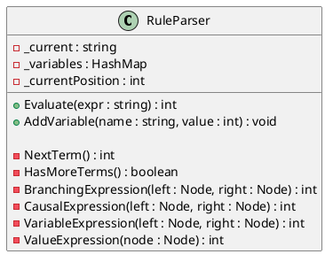
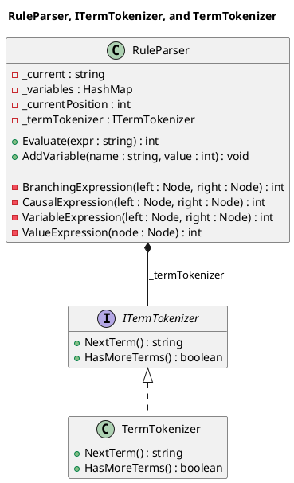

# How do we write a test for a private method?

Normally we would test it indirectly through the class public interface but this could be difficult with legacy code.

Feathers discusses this in his excellent book: *Working Effectively with Legacy Code* - Michael C. Feathers 2005,
chapter 20.

> So, how do we write a test for a private method? This has to be one of the most common testing-related questions.
> Fortunately, there is a very direct answer to this question: If we need to test a private method, we should make it
> public. If making it public bothers us, in most cases, it means that our class is doing too much, and we ought to fix
> it.
> We can move the private methods to a new class. They can be public in that class and our class can create an internal
> instance of it. That makes the methods testable and the design better.

---

This class violates the Single Responsibility Principle.



It seems that `RuleParser` has the following responsibilities:

- Parsing
- Expression evaluation
- Term tokenization
- Variable management

The `RuleParser` class has two public methods: `Evaluate` and `AddVariable`. Everything else is private. What would the
`RuleParser` class be like if we made `NextTerm` and `HasMoreTerms` public? Well, it would seem pretty odd. Users of the
`RuleParser` might get the idea that they have to use those two methods along with `Evaluate` to parse and evaluate
expressions.

It would be odd to have those methods public on the `RuleParser` class, but it is far less odd—and, actually, perfectly
fine—to make them public methods on a `TermTokenizer` class.

---

```PlantUML
@startuml

hide empty members

title "RuleParser and TermTokenizer"

class RuleParser {
  - _current : string
  - _variables : HashMap
  - _currentPosition : int
  - _termTokenizer : TermTokenizer

  + Evaluate(expr : string) : int
  + AddVariable(name : string, value : int) : void

  - BranchingExpression(left : Node, right : Node) : int
  - CausalExpression(left : Node, right : Node) : int
  - VariableExpression(left : Node, right : Node) : int
  - ValueExpression(node : Node) : int
}

class TermTokenizer {
  + NextTerm() : string
  + HasMoreTerms() : boolean
}

RuleParser *-- TermTokenizer : _termTokenizer

@enduml


```

We moved the responsibility of Term tokenization into a different class. We can now test `NextTerms()` and
`HasMoreTerms()` directly since they are now public.

Of course, if `TermTokenizer` is a volatile dependency then we need to hide it behind an interface to avoid violating
the Dependency Inversion Principle.

```PlantUML


In conclusion, testing private methods can be a challenge, but it is important to have good test coverage for our code.
If we need to test a private method, we should make it public or move it to a separate class. This helps to improve the
design of the class and make the method more testable. In the case of the `RuleParser` class, it was found that it had
multiple responsibilities and violated the Single Responsibility Principle. By moving the term tokenization
responsibility to a separate class, the design became clearer, and the methods could be tested directly.

---
See Also:
- [Single Responsibility Principle (SRP)](Single-Responsibility-Principle-SRP.md)
- [Dependency Inversion Principle (DIP)](Dependency-Inversion-Principle-DIP.md)
- [Stable vs Volatile Dependencies](Stable-vs-Volatile-Dependencies.md)
- [Code Review Checklist](Code-Review-Checklist.md) (mentions private methods)
- [Seam Interface](Seam-Interface.md) (related testing technique)

