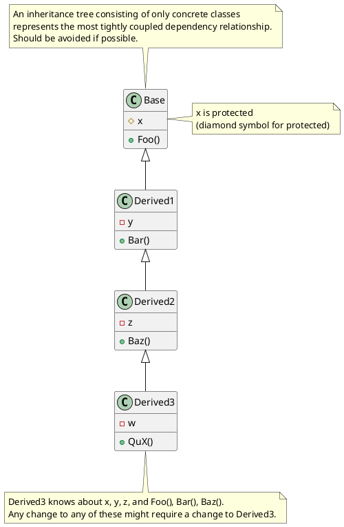
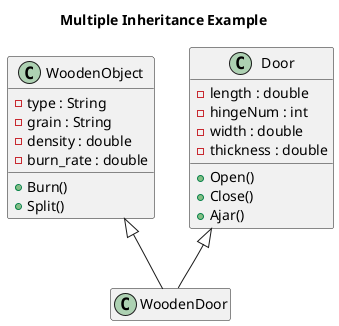
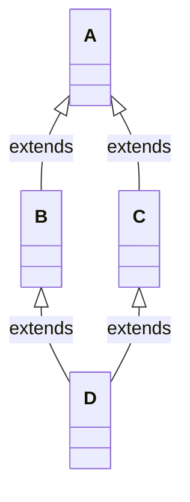

# Inheritance

Inheritance is a feature of object-oriented programming languages by which classes may be specialized from a more
general superclass. Attributes and method definitions from superclasses are automatically acquired by subclasses. Entire
class hierarchies can be made this way: from a base class, one or more classes can be derived; from each of these, zero
or more classes can be derived.

Inheritance avoids duplicating code (see DRY Principle); instead of copying everything from one class into another and
then adding new data and behavior, you create a new class that inherits from an existing one. Inheritance supports an
“is-a” relationship (e.g., “a cat is a mammal”, “a mammal is an animal”).

**Inheritance is the strongest and most rigid of source code relationships and should be used with great care**. If its
primary purpose is reuse, then inheritance is being used incidentally, which can lead to issues when trying to use the
relationship polymorphically. Behavioral compatibility is key: if a derived class is modified in such a way that it is
no longer behaviorally compatible with its parent (i.e., the parent can no longer be exchanged with the descendant see
Liskov Substitution Principle), then the class is said to be specialized. (Jacobson 64) For code reuse, prefer
composition—that is, assembling behaviors instead of inheriting them. (GOF 20)

## Types of Inheritance

### Implementation Inheritance

- Derived classes inherit data and behavior (implementation) from the base class.
- In languages like C++, this is approximated using private inheritance.
- Implementation inheritance can degenerate into a “like-a” relationship when the derived class violates Liskov’s
  substitution principle. (Coplien 206, 237)
- When inheritance is used as “is-a,” software reuse is an incidental benefit.

### Interface Inheritance

- Derived classes inherit only the public interface of the base class and must provide their own implementation.
- In C++, this is approximated by inheriting from pure abstract classes; in C#, interfaces are used.
- When a class implements an interface, it is said to have a “can-do” relationship with the interface. (Jeffrey Richter)

*Often, a mixture of both types is used.*

## Design Guidelines

- Prefer composition over class inheritance (GOF 20) to avoid tightly coupled dependencies.
- **Guidelines for Inheritance:**
    - Use the protected access specifier carefully:
        - All fields in a base class should be private; do not use protected data. (Riel 82)
        - Protected fields are implementation details that derived classes shouldn't need to know about.
    - Every class in the inheritance hierarchy, depending on that data, is subject to breaking changes.
- The term “inheritance” is used both when a class derives from a concrete (non-abstract) class to make a specialized
  version of it and when an abstract class is used as a starting point for different implementations. (Shalloway 137)
- If it is possible to use one of a base class’s descendants in all the places where the base class is used, the classes
  are said to be behaviorally compatible. (Jacobson 64, LSP)

## Inheritance Hierarchy Example

## Multiple Inheritance and the Diamond Problem

Multiple inheritance is generally discouraged because it often reduces understanding of the class hierarchy. (Jacobson
67) If you have an example of multiple inheritance in your design, assume you have made a mistake and then prove
otherwise. (Riel 134)

### Valid Cases for Multiple Inheritance

- It can be useful for capturing relationships known as subtyping for combination (mixings) when the two base classes
  are from different domains. (Riel 6.3)

### The Diamond Problem

The ["diamond problem"](https://en.wikipedia.org/wiki/Multiple_inheritance), sometimes referred to as the "Deadly
Diamond of Death", is an ambiguity that arises when two classes (B and C) inherit from the same base class (A) and a
class (D) inherits from both B and C. If there is a method in A that both B and C override, and D does not override it,
then it is unclear which version D inherits.

C# avoids the diamond problem by not allowing multiple inheritance of classes. However, it does allow multiple
inheritance of interfaces.

---
See Also:

- [Composition](Composition.md)
- [Prefer Composition over Class Inheritance](Prefer-Composition-over-Class-Inheritance.md)
- [DRY Principle](DRY-Principle.md)
- [Polymorphism](Polymorphism.md)
- [Liskov Substitution Principle (LSP)](Liskov-Substitution-Principle-LSP.md)
- [Abstract Classes vs Interfaces](Abstract-Classes-vs-Interfaces.md)
- [Pillars of OOP](Pillars-of-OOP.md)
- [Design Relationships](Design-Relationships.md)
- [The Dependency Rule](The-Dependency-Rule.md) (mentions inheritance as strongest relationship)