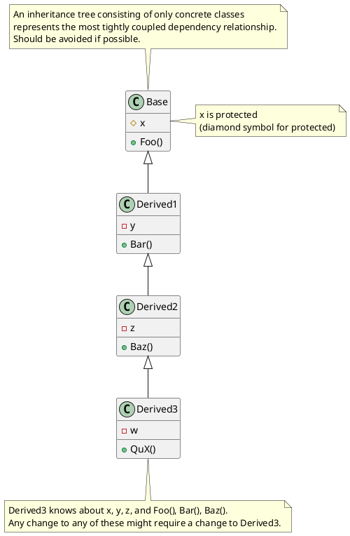
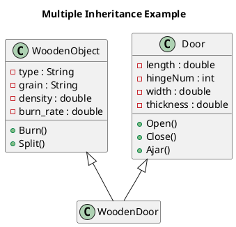
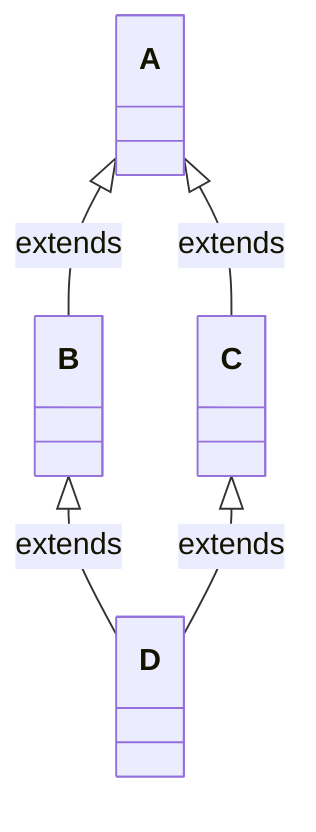

# Inheritance

If we have Class1 and we want to create Class2 that has everything Class1 has but more, we can copy everything in Class1
and paste it into Class2 and add the new data and behavior.  
This would cause duplicated code. See DRY Principle.  
Instead, use inheritance.  
Create Class2 that inherits from Class1.

We can make entire class hierarchies this way. From a base class, one or more classes can be derived. From each of these
classes, zero or more classes can be derived, and so on. The power of inheritance lies in its abstraction and
organization techniques.

An inheritance tree can grow quite large. This is one reason many developers are wary of using inheritance at all.
Often, it is difficult to decide how much abstraction is required.

You should Prefer composition over class inheritance (GOF 20).  
Inheritance is an “is-a” relationship. We say, “a cat is a mammal” and “a mammal is an animal.”

Top-down/Bottom-up perspective - specialization/ generalization

### Guidelines:

- **Protected access specifier** (see pg 439 of text)
- All fields in a base class should be private; do not use protected data (Riel 82)
- Protected fields are implementation details that derived class shouldn't need to know about.
- Every class in the inheritance hierarchy, depending on that data, is subject to breaking changes.

### Multiple Inheritance

If you have an example of multiple inheritance in your design, assume you have made a mistake and then prove otherwise. (Riel 134)  
The major disadvantage with multiple inheritance is that it often reduces understanding of class hierarchy. (Jacobson 67)

#### When is multiple inheritance valid?

Useful for capturing a relationship known as subtyping for combination (mixings). It is used to define a new class that
is actually a special type of two other classes and those two base classes are from different domains. (Riel 6.3)  
In C# we achieve this using interfaces.

The ["diamond problem"](https://en.wikipedia.org/wiki/Multiple_inheritance) (sometimes referred to as the "Deadly
Diamond of Death") is an ambiguity that arises when two classes B and C inherit from A, and class D inherits from both B
and C. If there is a method in A that B and C have overridden, and D does not override it, then which version of the
method does D inherit: that of B, or that of C?

C# avoids this by not allowing multiple inheritance and providing interfaces.

