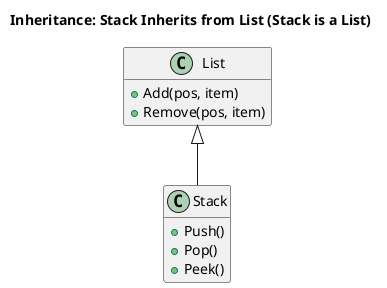
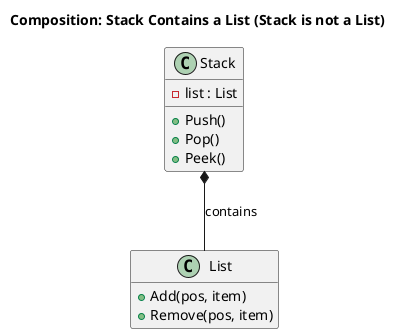

# Prefer Composition over Class Inheritance (GOF 20)

If inheritance causes your class's public interface to lack cohesion, then you should prefer composition.

We know a **Stack** is something that has LIFO behaviour. We express this behaviour in a Stack's public interface with
`Push()`, `Pop()`, `Peek()`.

We know a **List** is something that allows adding and removing items from arbitrary positions, with methods like
`Add(pos, item)` and `Remove(pos, item)`.

Implementing a Stack by inheriting from List will cause the public interface of the Stack to include the public
interface of the List. This Stack class is not cohesive because the inherited methods are incompatible with the LIFO
behaviour of Stack objects. (Dianxiang Xu 87)

The composition solution is for Stack to contain a List as a private member and implement `Push()`, `Pop()`, etc., by
delegating behaviour to the List member.

---

## UML Diagram Examples

### 1. Inheritance Approach

In the inheritance approach, the `Stack` class inherits from `List`, thereby acquiring all of its methods—even those
that are not applicable to a stack.

### 2. Composition Approach

In the composition approach, the `Stack` class has a private member of type `List` and only exposes the methods that are
relevant to its LIFO behaviour.

By using composition, the `Stack` class hides the full public interface of the `List` and exposes only those methods
that are applicable to a stack's LIFO behaviour.
