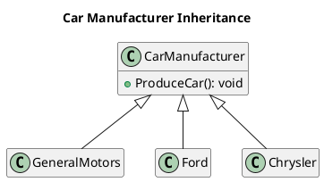
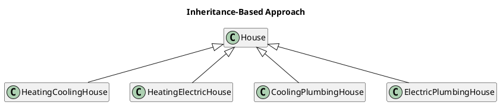
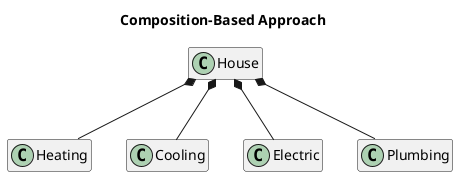
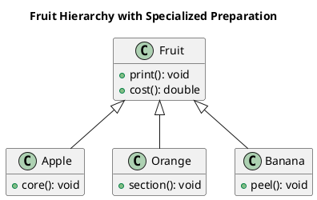
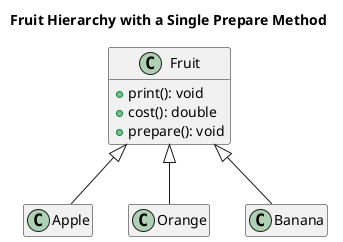
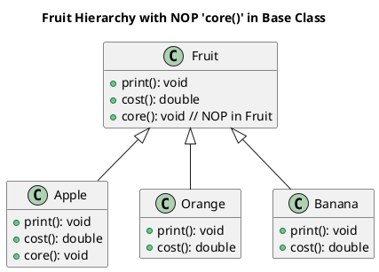
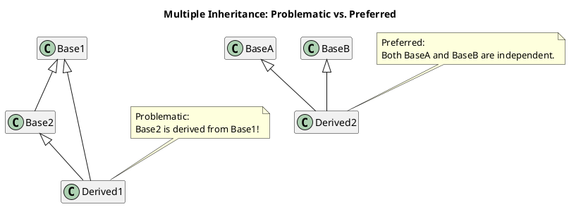

# Some Object-Oriented Design Heuristics - Riel (updated)

Below is the updated markdown document with modernized terminology and the appropriate SOLID annotations appended where
applicable.

## Chapter 2. Classes and Objects: The Building Blocks of the Object-Oriented Paradigm

**Heuristic 2.1**  
_Encapsulate all data within its class._

**Heuristic 2.2**  
_Clients of a class should rely solely on its public API, while the class remains independent of its consumers._ (
Dependency Inversion Principle DIP)

**Heuristic 2.3**  
_Reduce the number of operations exposed in a class’s public protocol._ (Interface Segregation Principle ISP)

**Heuristic 2.4**  
_Design a minimal yet universal public interface that every class can implement (e.g., operations such as deep versus
shallow copying, equality checks via the
Equals
Equals method, formatted output using
ToString
ToString, or parsing from text—all typically inherited from the base
Object
Object class in languages like C#).._

**Heuristic 2.5**  
_Avoid exposing internal implementation details or helper functions in the public API._

**Heuristic 2.6**  
_Keep the public interface clean and focused; do not include functions that are irrelevant or inaccessible to the
class’s users._ (Interface Segregation Principle ISP)

**Heuristic 2.8**  
_A class should represent a single, coherent abstraction._ (Single Responsibility Principle SRP)

**Heuristic 2.9**  
_Co-locate related data and behavior in a single class._ (Single Responsibility Principle SRP)

**Heuristic 2.10**  
_Separate unrelated concerns into distinct classes to avoid coupling dissimilar behaviors._ (Single Responsibility
Principle SRP)

---

## Chapter 3. Application Architectures: Procedural Versus Object-Oriented Paradigms

**Heuristic 3.1**  
_Distribute system logic evenly across top-level classes so that each shares an equal part of the workload._

**Heuristic 3.2**  
_Avoid “god objects”; be cautious of classes whose names include terms like Driver, Manager, System, or Subsystem._

**Heuristic 3.3**  
_If a class exposes many accessor methods, it may indicate that related data and behavior are not properly
integrated._ (Single Responsibility Principle SRP)

**Heuristic 3.4**  
_Watch out for classes where methods operate on only a subset of its data; such noncommunicating behavior can be
symptomatic of poor cohesion._ (Single Responsibility Principle SRP)

**Heuristic 3.5**  
_In applications that combine an object-oriented model with a graphical user interface (GUI), the model should remain
independent of the GUI layer. The GUI should depend on the model for data and operations, but the model must not import
or invoke any GUI-related code._

**Heuristic 3.6**  
_Model real-world entities and relationships whenever feasible._  
*(This guideline is sometimes compromised to evenly distribute system logic, avoid god objects, or maintain cohesion.)*

**Heuristic 3.9**  
_Avoid encapsulating a single operation as an independent class. Be wary of classes named after actions or
verbs—especially if they encapsulate only one significant behavior (excluding trivial getters or setters)._

---

## Chapter 4. Relationships Between Classes and Objects

**Heuristic 4.6**  
_Most class methods should operate on most of its data members._ (Single Responsibility Principle SRP)

**Heuristic 4.7**  
_Classes should not manage more components than can be effectively handled in short-term memory. A common guideline is
around six elements._

**Heuristic 4.8**  
_Design your system using composition by creating deep, narrow hierarchies—each class contains only one or two closely
related items, rather than one class managing many components._

**Heuristic 4.13**  
_A class should be aware of its own members, but remain ignorant of the context in which it is contained._

**Heuristic 4.14**  
_Objects defined within the same scope should avoid direct dependencies on one another._

---

## Chapter 5. The Inheritance Relationship

**Heuristic 5.1**  
_Use inheritance solely for representing specialization hierarchies._ (Liskov Substitution Principle LSP)

**Heuristic 5.2**  
_While derived classes naturally depend on their base classes, base classes should remain agnostic of their subclasses._

**Heuristic 5.3**  
_Keep all base class data private; avoid using protected members._

**Heuristic 5.4**  
_Theoretically, deeper inheritance hierarchies can seem ideal—the deeper, the better._

**Heuristic 5.5**  
_In practice, however, inheritance hierarchies should remain shallow enough for practical comprehension; typically,
around six levels is advisable._

**Heuristic 5.6**  
_All abstract classes should serve as base classes._

**Heuristic 5.7**  
_All base classes should be abstract._

**Heuristic 5.8**  
_Extract common data, behavior, or interfaces as high as possible in the inheritance chain._

**Heuristic 5.9**  
_If classes share only data (without behavior), encapsulate that data in a separate class which is then composed within
each class._

**Heuristic 5.10**  
_If classes share both data and behavior, they should inherit from a common base class that encapsulates these
elements._

**Heuristic 5.11**  
_If classes share only a set of method signatures with no shared implementation, create a common base class only when
you need to treat them polymorphically. Otherwise, avoid enforcing an inheritance relationship solely for the sake of a
common interface._

**Heuristic 5.12**  
_Avoid explicit type checking; favor polymorphism to manage different object types._ (Liskov Substitution Principle LSP)

**Heuristic 5.13**  
_Rather than using conditional logic based on attribute values, decompose the class into distinct subclasses where each
represents a specific attribute value. This leverages polymorphism to handle behavioral differences._

**Heuristic 5.15**  
_Avoid converting individual objects into subclasses. Exercise caution with subclasses that are instantiated only once._

**Heuristic 5.16**  
_If you feel the need to generate new classes at runtime, reconsider the design: you are likely dealing with objects
that should be generalized within an existing class._

**Heuristic 5.17**  
_Derived classes should not override base class methods with no-operation (NOP) implementations._ (Liskov Substitution
Principle LSP)

**Heuristic 5.18**  
_Do not substitute optional composition with inheritance; using inheritance to model optional behavior can lead to an
excessive number of classes._

*This example underscores the preference for composition over inheritance. While composition may require separate
classes for individual features, it prevents the exponential growth of subclasses that arises when every feature
combination demands its own subclass. Instead, a single container class can dynamically integrate various feature
classes as needed.*

**Heuristic 5.19**  
_A Problem with No Optimal Solution_  
Ensure that the underlying issue is genuine before exploring solutions. This problem often occurs due to naming problems
of methods.

Assuming the issue is valid, options become limited. Many designers opt to define a core method in the Fruit class that
acts as a no-operation (NOP) by default. This design pattern is often referred to as the “fat interface” solution.

---

## Chapter 6. Multiple Inheritance

**Heuristic 6.1**  
_If your design includes multiple inheritance, assume it is erroneous until you can justify its correctness._

**Heuristic 6.3**  
_In designs featuring multiple inheritance, ensure that none of the base classes are themselves derived from another
base class._

---
See Also:
- [Some Object-Oriented Design Heuristics - Riel updated](Some-Object-Oriented-Design-Heuristics-Riel-updated.md) <!-- Prefer linking to the updated one -->
- [SOLID Design Principles](SOLID-Design-Principles.md)
- [Cohesion](Cohesion.md)
- [Coupling](Coupling.md)
- [Pillars of OOP Encapsulation Abstraction](Pillars-of-OOP-Encapsulation-Abstraction.md)
- [Inheritance](Inheritance.md)
- [Composition](Composition.md)
- [Polymorphism](Polymorphism.md)