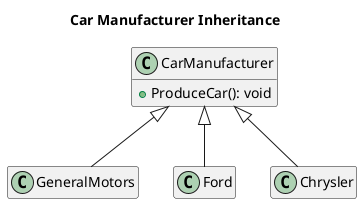
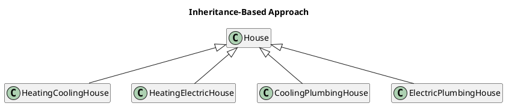
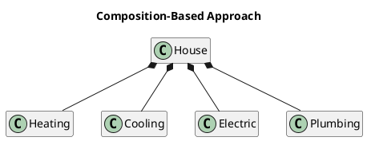
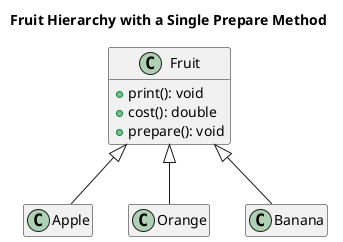
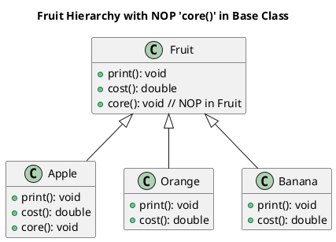
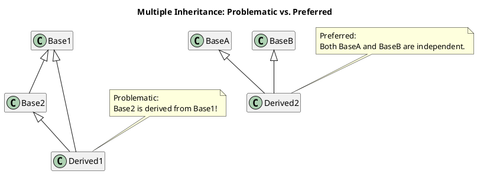

# Some Object-Oriented Design Heuristics - Riel

---

## Chapter 2. Classes and Objects: The Building Blocks of the Object-Oriented Paradigm

**Heuristic 2.1**  
_All data should be hidden within its class._

**Heuristic 2.2**  
_Users of a class must be dependent on its public interface, but a class should not be dependent on its users._

**Heuristic 2.3**  
_Minimize the number of messages in the protocol of a class._

**Heuristic 2.4**  
_Implement a minimal public interface that all classes
understand [e.g., operations such as copy (deep versus shallow), equality testing, pretty printing, parsing from an ASCII description, etc.]._

**Heuristic 2.5**  
_Do not put implementation details such as common-code private functions into the public interface of a class._

**Heuristic 2.6**  
_Do not clutter the public interface of a class with things that users of that class are not able to use or are not
interested in using._

**Heuristic 2.8**  
_A class should capture one and only one key abstraction._

**Heuristic 2.9**  
_Keep related data and behavior in one place._

**Heuristic 2.10**  
_Spin off non related information into another class (i.e., noncommunicating behavior)._

---

## Chapter 3. Topologies of Action-Oriented (Procedural) Versus Object-Oriented Applications

**Heuristic 3.1**  
_Distribute system intelligence horizontally as uniformly as possible, that is, the top-level classes in a design should
share the work uniformly._

**Heuristic 3.2**  
_Do not create god classes/objects in your system. Be very suspicious of a class whose name contains Driver, Manager,
System, or Subsystem._

**Heuristic 3.3**  
_Beware of classes that have many accessor methods defined in their public interface. Having many implies that related
data and behavior are not being kept in one place._

**Heuristic 3.4**  
_Beware of classes that have too much noncommunicating behavior, that is, methods that operate on a proper subset of the
data members of a class. God classes often exhibit a great deal of noncommunicating behavior._

**Heuristic 3.5**  
_In applications that consist of an object-oriented model interacting with a user interface, the model should never be
dependent on the interface. The interface should be dependent on the model._

**Heuristic 3.6**  
_Model the real world whenever possible._  
*(This heuristic is often violated for reasons of system intelligence distribution, avoidance of god classes, and the
keeping of related data and behavior in one place.)*

**Heuristic 3.9**  
_Do not turn an operation into a class. Be suspicious of any class whose name is a verb or is derived from a verb,
especially those that have only one piece of meaningful behavior (i.e., do not count sets, gets, and prints). Ask if
that piece of meaningful behavior needs to be migrated to some existing or undiscovered class._

## Chapter 4. The Relationships Between Classes and Objects

**Heuristic 4.6**  
_Most of the methods defined on a class should be using most of the data members most of the time._

**Heuristic 4.7**  
_Classes should not contain more objects than a developer can fit in his or her short-term memory. A favorite value for
this number is six._

**Heuristic 4.8**  
_Distribute system intelligence vertically down narrow and deep containment hierarchies._

**Heuristic 4.13**  
_A class must know what it contains, but it should never know who contains it._

**Heuristic 4.14**  
_Objects that share lexical scope ("those contained in the same containing class") should not have uses relationships
between them._

## Chapter 5. The Inheritance Relationship

**Heuristic 5.1**  
_Inheritance should be used only to model a specialization hierarchy._

**Heuristic 5.2**  
_Derived classes must have knowledge of their base class by definition, but base classes should not know anything about
their derived classes._

**Heuristic 5.3**  
_All data in a base class should be private; do not use protected data._

**Heuristic 5.4**  
_In theory, inheritance hierarchies should be deep — the deeper, the better._

**Heuristic 5.5**  
_In practice, inheritance hierarchies should be no deeper than an average person can keep in his or her short-term
memory. A popular value for this depth is six._

**Heuristic 5.6**  
_All abstract classes must be base classes._

**Heuristic 5.7**  
_All base classes should be abstract classes._

**Heuristic 5.8**  
_Factor the commonality of data, behavior, and/or interface as high as possible in the inheritance hierarchy._

**Heuristic 5.9**  
_If two or more classes share only common data (no common behavior), then that common data should be placed in a class
that will be contained by each sharing class._

**Heuristic 5.10**  
_If two or more classes have common data and behavior (i.e., methods), then those classes should each inherit from a
common base class that captures those data and methods._

**Heuristic 5.11**  
_If two or more classes share only a common interface (i.e., messages, not methods), then they should inherit from a
common base class only if they will be used polymorphically._

**Heuristic 5.12**  
_Explicit case analysis on the type of an object is usually an error. The designer should use polymorphism in most of
these cases._

**Heuristic 5.13**  
_Explicit case analysis on the value of an attribute is often an error. The class should be decomposed into an
inheritance hierarchy, where each value of the attribute is transformed into a derived class._

**Heuristic 5.15**  
_Do not turn objects of a class into derived classes of the class. Be very suspicious of any derived class for which
there is only one instance._



**Heuristic 5.16**  
_If you think you need to create new classes at runtime, take a step back and realize that what you are trying to create
are objects. Now generalize these objects into a class._

**Heuristic 5.17**  
_It should be illegal for a derived class to override a base class method with a NOP method, that is, a method that does
nothing._

**Heuristic 5.18**  
_Do not confuse optional containment with the need for inheritance. Modeling optional containment with inheritance will
lead to a proliferation of classes._

**Note:** This example further illustrates the preference for composition over inheritance. Although composition requires separate classes for each feature, it avoids the exponential proliferation of subclasses that occurs when every feature combination necessitates its own subclass. Instead, a single container class can flexibly incorporate various feature classes as needed.






**Heuristic 5.19**  
A Problem with No Optimal Solution  
It is important to be sure that the problem actually exists before discussing the possible solutions. This problem often
occurs due to naming problems of methods.
 ```plantuml
@startuml
hide empty members
title "Fruit Hierarchy with Specialized Preparation"

class Fruit {
  + print(): void
  + cost(): double
}

class Apple {
  + core(): void
}

class Orange {
  + section(): void
}

class Banana {
  + peel(): void
}

Fruit <|-- Apple
Fruit <|-- Orange
Fruit <|-- Banana
@enduml
```




Assuming that the problem really exists, our options are limited.  
To many designers, the best solution is to define a core method on the fruit class which is defined as a NOP. This
design choice is often called the "fat interface" solution.  


## Chapter 6. Multiple Inheritance

**Heuristic 6.1**  
_If you have an example of multiple inheritance in your design, assume you have made a mistake and then prove
otherwise._

**Heuristic 6.3**  
_Whenever you have found a multiple inheritance relationship in an object-oriented design, be sure that no base class is
actually a derived class of another base class._


