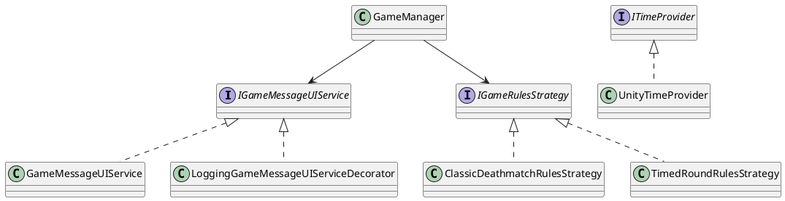

# Unity Case Study – Refactoring “Tanks!” with SOLID Principles and Design Patterns

The starting point was the `GameManager` class from Unity's **“Tanks!”** tutorial. This class initially handled numerous
responsibilities: the game loop, tank spawning, win‑condition checks, UI updates, and camera control.

---

## Phase 1 – Single Responsibility Principle (SRP) & Testability

* **Problem** – `GameManager` mixed unrelated concerns, blocking unit tests.
* **UI Extraction** – moved HUD message logic into `GameMessageUIService` behind an `IGameMessageUIService` interface.
* **Rules Extraction** – extracted round‑end rules behind the `IGameRulesStrategy` abstraction.

### Key Code Snippet

```C#
public interface IGameMessageUIService
{
    void DisplayRoundStart(int round);
    void ClearMessage();
    void DisplayRoundEndResults(
        TankManager roundWinner,
        TankManager gameWinner,
        TankManager[] allTanks);
}

public class GameMessageUIService : IGameMessageUIService
{
    private readonly Text _msg;
    public GameMessageUIService(Text msg)
    {
        _msg = msg ?? throw new ArgumentNullException(nameof(msg));
    }

    public void DisplayRoundStart(int round) =>
        _msg.text = $"ROUND {round}";

    public void ClearMessage() => _msg.text = string.Empty;
}
```

---

## Phase 2 – Design‑Pattern Flexibility

With responsibilities isolated, classic patterns were layered on:

* **Decorator** – `LoggingGameMessageUIServiceDecorator` adds logging without touching tested code.
* **Strategy** – `IGameRulesStrategy` allows pluggable game modes.

    * `ClassicDeathmatchRulesStrategy`
    * `TimedRoundRulesStrategy`

### Strategy & Decorator Excerpts

```C#
public interface IGameRulesStrategy
{
    void StartRound();
    bool IsRoundOver(TankManager[] tanks);
    TankManager DetermineRoundWinner(TankManager[] tanks);
    TankManager DetermineGameWinner(TankManager[] tanks);
}

public class LoggingGameMessageUIServiceDecorator : IGameMessageUIService
{
    private readonly IGameMessageUIService _inner;
    private readonly ILogger _log;

    public LoggingGameMessageUIServiceDecorator(
        IGameMessageUIService inner,
        ILogger log)
    {
        _inner = inner;
        _log = log;
    }

    // Methods delegate then log…
}
```

---

## Phase 3 – Abstraction of External Dependencies

`TimedRoundRulesStrategy` depended on `Time.time` and live `GameObject` state. Two thin interfaces removed those Unity
ties:

```C#
public interface ITimeProvider
{
    float Time { get; }
    float DeltaTime { get; }
}

public class UnityTimeProvider : ITimeProvider
{
    public float Time => UnityEngine.Time.time;
    public float DeltaTime => UnityEngine.Time.deltaTime;
}

public interface IHealthProvider
{
    float CurrentHealth { get; }
}
```

Unit tests inject `MockTimeProvider` and `MockHealthProvider`, letting all rules run under plain .NET test runners.

---

## Wiring – Manual Composition in `GameManager`

No DI container was used. Dependencies are instantiated once in `Start()` and passed to the strategies/services:

```C#
private void Start()
{
    ILogger log = new UnityLogger();
    var baseSrv = new GameMessageUIService(m_MessageTextComponent);
    m_GameMessageUIService = new LoggingGameMessageUIServiceDecorator(baseSrv, log);

    m_GameRulesStrategy = m_SelectedGameMode switch
    {
        GameMode.TimedRounds =>
            new TimedRoundRulesStrategy(
                m_RoundDurationSeconds,
                m_NumRoundsToWin,
                new UnityTimeProvider()),
        _ => new ClassicDeathmatchRulesStrategy(m_NumRoundsToWin)
    };
}
```

This **begins** treating `GameManager` (a `MonoBehaviour`) as a **composition root** – it wires pure C# services
together, then forwards Unity lifecycle events.

---

## UML Overview



---

## Summary

1. **SRP Foundation** – UI and rule logic separated from `GameManager`.
2. **Design Patterns** – Decorator adds logging; Strategy allows new game modes.
3. **Test‑Friendly Abstractions** – time & health wrapped.
4. **Path to Thin Roots** – current manual wiring shows the first step toward true composition‑root `MonoBehaviour`s.

> **Recommended reading:** Unite 2016 “Overthrowing the MonoBehaviour Tyranny”; **Unity in Action** (2018) Ch. 9; Unity
> e‑book *Level Up Your Code with SOLID*.
